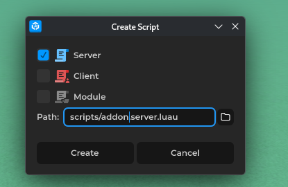
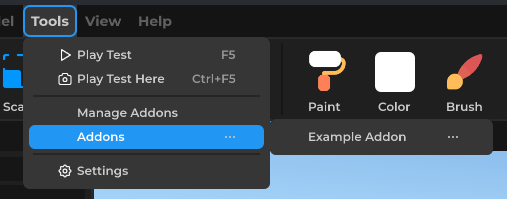

# Creating an Addon

Addons are useful scripts that let you create useful tools for the creator

> **Note:** Addons can only be used in the Creator

Create a new **script**:


Select a **Server** Script



Open the **Script** and register a new [AddonObject](../../api/types/addons/AddonObject/)
```lua
local addonObject = Addons:Register("Example")
addonObject.AddonName = "Example Addon"
```

## Addon Icon

Set an icon that will appear in the tools menu using a [PTImageAsset](../../api/types/assets/PTImageAsset/):

```lua
local icon = PTImageAsset.New()
icon.ImageID = 0
icon.ImageType = Enums.ImageType.Asset
addonObject.AddonIcon = icon
```

## Tool Items

Tool items appear in the addon's dropdown menu. Create them with `CreateToolItem` and listen for the `Pressed` event:

```lua
local myTool = addonObject:CreateToolItem("My Tool")

myTool.Pressed:Connect(function()
    print("Tool item pressed!")
end)
```

## Requesting Permissions

Some features require user permission. Prompt the player with `RequestPermissions` using the [AddonPermission](../../api/enums/AddonPermission/) enum:

```lua
addonObject:RequestPermissions({
    Enums.AddonPermission.IORead,
    Enums.AddonPermission.IOWrite
})
```

## Cleanup

When the creator updates or removes your addon, the `CleanupReceived` event fires. Use this to clean up any resources:

```lua
addonObject.CleanupReceived:Connect(function()
    -- clean up GUI elements, connections, etc.
end)
```

## Working with Selections

Use [CreatorSelections](../../api/types/addons/CreatorSelections/) to interact with the creator's selection system:

```lua
-- Select a specific instance
Selections:Select(somePart)

-- Get all selected instances
local selected = Selections:GetSelected()

-- Deselect all, then select only this instance
Selections:SelectOnly(somePart)

-- Deselect everything
Selections:DeselectAll()
```

Listen for selection changes:

```lua
Selections.Selected:Connect(function()
    print("Something was selected")
end)

Selections.Deselected:Connect(function()
    print("Something was deselected")
end)
```

## Undo and Redo

[CreatorHistory](../../api/types/addons/CreatorHistory/) lets you add undo/redo support to your addon:

```lua
History:NewAction("My Action")

History:AddDoCallback(function()
    -- redo logic
end)

History:AddUndoCallback(function()
    -- undo logic
end)

History:CommitAction()
```

## Overlaying GUI

[CreatorGUI](../../api/types/addons/CreatorGUI/) allows you to overlay UI on top of the creator viewport. Create a GUI and parent it to the CreatorGUI object:

```lua
local gui = Instance.New("GUI")
local UIView = Instance.New("UIView") -- for a visual queue
UIView.Parent = gui
gui.Parent = CreatorGUI
```

## Reading Creator State

[CreatorInterface](../../api/types/addons/CreatorInterface/) provides information about the current creator state:

```lua
print("Current tool mode:", Creator.Interface.ToolMode)
print("Target part color:", Creator.Interface.TargetPartColor)
print("Move snapping:", Creator.Interface.MoveSnapping)
```

## Installing the Addon

Once your script is ready, install it as an addon:


The addon will now appear in the creator's tools menu under the name you set with `AddonName`.



An Example addon:
```lua
local addon = Addons:Register("UI-Utils")
addon.AddonName = "UI Utils"
local _toClean = {}
local function addToCleaning(task)
    table.insert(_toClean,task)
    return task
end

addon.CleanupReceived:Connect(function(...)
	for _,task in _toClean do
        if type(task) == "function" then
            coroutine.wrap(task)()
            continue
        end
        local f = task.Destroy or task.destroy or task.Disconnect or task.Release
        if not f then continue end
        coroutine.wrap(f)(task)
    end
end)

local warningGUI = addToCleaning(Instance.New("GUI", CreatorGUI))

local function backOut(t: number): number
	local s = 1.70158
	t = t - 1
	return t * t * ((s + 1) * t + s) + 1
end

local function createWarning(text: string, color: Color)
	local label = addToCleaning(Instance.New("UILabel")) :: UILabel
	label.Text = text
	label.TextColor = color
	label.BorderColor = Color.New(0, 0, 0, 0)
	label.Color = Color.New(0, 0, 0, 0)
	label.SizeOffset = Vector2.Zero
	label.SizeRelative = Vector2.New(1, 0.1)
	label.PivotPoint = Vector2.New(0.5, 1)
	label.PositionRelative = Vector2.New(0.5, 1.1)
	label.Parent = warningGUI

	local entryTween = addToCleaning(Tween:NewTween()) :: TweenObject
    
	entryTween:TweenNumber(0, 1, 0.4, function(alpha)
		label.PositionRelative = Vector2.New(0.5, math.lerp(1.1, 1.0, backOut(alpha)))
	end)

	entryTween.Finished:Wait()
	entryTween:Stop()
	wait(1.5)

	local fadeTween = addToCleaning(Tween:NewTween()) :: TweenObject
	fadeTween:TweenColor(color, Color.New(color.R, color.G, color.B, 0), 0.8, function(c)
		label.TextColor = c
	end)

	fadeTween.Finished:Wait()
	label:Destroy()
end

local function getSelection(): UIField?
	local selected = Selections:GetSelected()[1]
	if selected and selected:IsA("UIField") then
		return selected :: UIField
	end
	createWarning("No UI selected!", Color.New(1, 0, 0))
	return nil
end

local function getAbsoluteInPixels(rel: Vector2, off: Vector2): (number, number)
	local w, h = Input.ScreenWidth, Input.ScreenHeight
	return (rel.X * w) + off.X, (rel.Y * h) - off.Y
end

addon:CreateToolItem("Position To Scale").Pressed:Connect(function()
	local ui = getSelection()
	if not ui then
		return
	end

	local x, y = getAbsoluteInPixels(ui.PositionRelative, ui.PositionOffset)
	ui.PositionOffset = Vector2.Zero
	ui.PositionRelative = Vector2.New(x / Input.ScreenWidth, math.abs(y / Input.ScreenHeight))
end)

addon:CreateToolItem("Size To Scale").Pressed:Connect(function()
	local ui = getSelection()
	if not ui then
		return
	end

	local x, y = getAbsoluteInPixels(ui.SizeRelative, ui.SizeOffset)
	ui.SizeOffset = Vector2.Zero
	ui.SizeRelative = Vector2.New(x / Input.ScreenWidth, math.abs(y / Input.ScreenHeight))
end)

addon:CreateToolItem("Position To Offset").Pressed:Connect(function()
	local ui = getSelection()
	if not ui then
		return
	end

	local x, y = getAbsoluteInPixels(ui.PositionRelative, ui.PositionOffset)
	ui.PositionRelative = Vector2.Zero
	ui.PositionOffset = Vector2.New(x, y)
end)

addon:CreateToolItem("Size To Offset").Pressed:Connect(function()
	local ui = getSelection()
	if not ui then
		return
	end

	local x, y = getAbsoluteInPixels(ui.SizeRelative, ui.SizeOffset)
	ui.SizeRelative = Vector2.Zero
	ui.SizeOffset = Vector2.New(x, y)
end)
```
